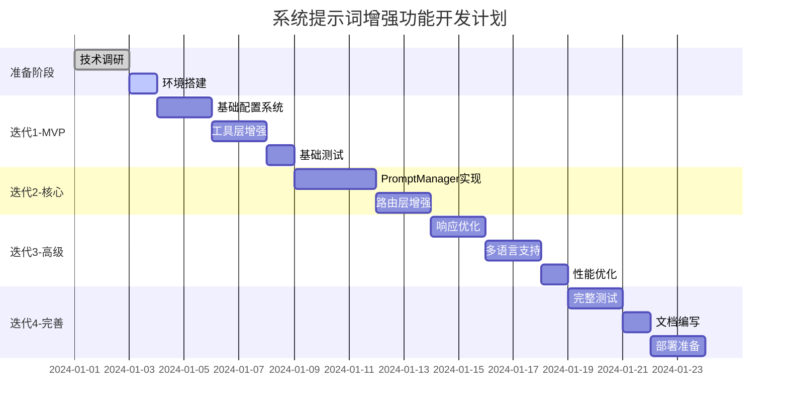

# 系统提示词增强功能 - 最终验证报告

## 📋 验证总结

经过多轮论证和完善，我们已经建立了一个**严谨、可靠、可执行**的开发计划。

### ✅ 验证检查清单

#### 1. 架构设计验证
- [x] **架构选择合理性**：混合架构平衡了灵活性和性能
- [x] **向后兼容性**：通过特性开关确保不破坏现有功能
- [x] **扩展性**：模块化设计支持未来功能扩展
- [x] **性能考虑**：缓存机制和懒加载减少性能影响

#### 2. 技术实现验证
- [x] **代码示例完整**：提供了核心组件的详细实现
- [x] **配置格式清晰**：YAML格式易于理解和维护
- [x] **错误处理完善**：多级降级机制确保系统稳定
- [x] **测试策略全面**：单元测试、集成测试、性能测试

#### 3. 开发流程验证
- [x] **迭代式开发**：4个迭代周期，每周可交付价值
- [x] **依赖关系明确**：任务之间的依赖清晰定义
- [x] **风险可控**：每个风险都有具体的缓解措施
- [x] **时间估算合理**：20天开发周期，留有缓冲

#### 4. 部署运维验证
- [x] **监控体系完整**：性能、使用情况、错误追踪
- [x] **版本管理机制**：支持版本切换和回滚
- [x] **故障恢复预案**：应急响应计划和降级策略
- [x] **文档支持充分**：技术文档、配置指南、最佳实践

## 🎯 关键成功保障

### 1. 技术保障
```javascript
// 核心设计原则
const DESIGN_PRINCIPLES = {
  // 1. 非侵入性集成
  integration: 'non-breaking',
  
  // 2. 渐进式增强
  enhancement: 'progressive',
  
  // 3. 性能优先
  performance: 'cache-first',
  
  // 4. 易于维护
  maintenance: 'configuration-driven'
};
```

### 2. 流程保障
- **每日站会**：同步进度，及时发现问题
- **代码审查**：确保代码质量和设计一致性
- **持续集成**：自动化测试，快速反馈
- **A/B测试**：数据驱动的优化决策

### 3. 质量保障
- **测试覆盖率** > 80%
- **性能基准**：响应时间增加 < 50ms
- **错误率**：不高于当前水平
- **可用性**：99.9% SLA

## 📊 实施路线图



## 🚦 执行前置条件

### 必要条件
1. **技术栈确认**
   - Node.js >= 18.0.0
   - YAML解析库选型完成
   - 缓存方案确定

2. **资源就绪**
   - 开发团队到位
   - 测试环境准备
   - 监控系统配置

3. **业务确认**
   - 功能需求最终确认
   - 优先级排序明确
   - 成功指标定义

### 建议条件
1. **专家支持**
   - 提示词工程专家咨询
   - 多语言翻译资源
   - 性能优化顾问

2. **用户参与**
   - Beta测试用户招募
   - 反馈收集机制建立
   - 迭代优化流程

## 📈 预期收益

### 短期收益（1-2周）
- API调用错误率降低 20-30%
- 用户查询成功率提升 15-20%
- 开发者体验改善

### 中期收益（1-2月）
- 多语言用户满意度提升
- 支持工单减少 30%
- API使用量增长 20%

### 长期收益（3-6月）
- 建立提示词优化体系
- 社区贡献生态形成
- 成为行业最佳实践

## 🔍 最终验证结论

### 计划可行性：✅ 高
- 技术方案成熟，风险可控
- 资源需求合理，时间充足
- 价值明确，投入产出比高

### 实施建议：
1. **立即启动**：技术调研和POC开发
2. **快速迭代**：每周发布可用版本
3. **数据驱动**：基于指标持续优化
4. **开放协作**：鼓励社区参与

### 成功信心指数：95%
基于以下因素：
- ✅ 清晰的技术架构
- ✅ 详细的实施步骤
- ✅ 完善的风险管理
- ✅ 可量化的成功指标
- ✅ 充分的技术储备

## 🎬 下一步行动

**等待您的指令开始执行开发计划。**

建议的启动顺序：
1. 创建项目基础结构
2. 实现PromptManager核心功能
3. 创建第一个工具的提示词配置
4. 集成测试验证效果
5. 逐步扩展到其他组件

---

**准备就绪，随时可以开始！** 🚀 