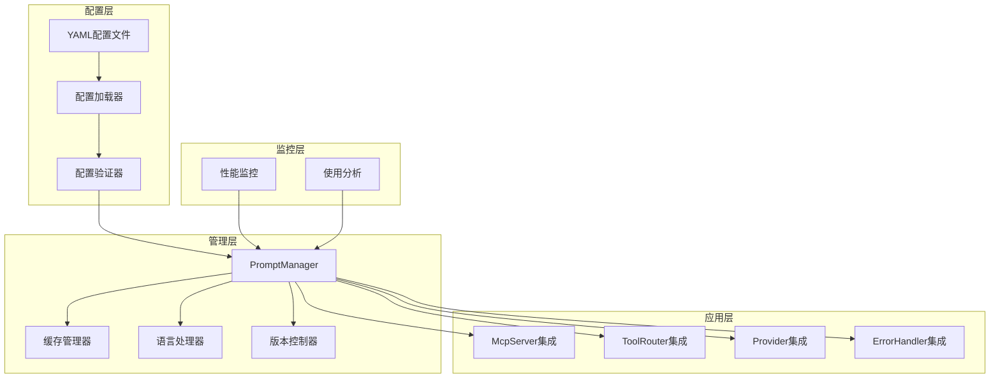

# 系统提示词增强功能技术规范

## 1. 技术架构详细设计

### 1.1 核心组件关系图



### 1.2 PromptManager 详细设计

```javascript
// src/core/PromptManager.js
class PromptManager {
  constructor(config = {}) {
    this.config = {
      defaultLanguage: 'en',
      cacheEnabled: true,
      cacheTTL: 3600, // 1小时
      promptsPath: './prompts',
      fallbackEnabled: true,
      ...config
    };
    
    this.cache = new Map();
    this.prompts = new Map();
    this.version = null;
  }

  async initialize() {
    try {
      // 1. 加载配置文件
      await this._loadPromptConfigs();
      
      // 2. 验证配置
      await this._validateConfigs();
      
      // 3. 初始化缓存
      this._initializeCache();
      
      // 4. 注册热更新（开发环境）
      if (process.env.NODE_ENV === 'development') {
        this._watchConfigChanges();
      }
      
      console.error('PromptManager initialized successfully');
      return true;
    } catch (error) {
      console.error('PromptManager initialization failed:', error);
      return false;
    }
  }

  // 获取工具提示词
  getToolPrompt(toolName, promptType = 'system', context = {}) {
    const cacheKey = `tool:${toolName}:${promptType}:${context.language || this.config.defaultLanguage}`;
    
    // 检查缓存
    if (this.config.cacheEnabled && this.cache.has(cacheKey)) {
      const cached = this.cache.get(cacheKey);
      if (Date.now() - cached.timestamp < this.config.cacheTTL * 1000) {
        return cached.value;
      }
    }
    
    // 构建提示词
    const prompt = this._buildToolPrompt(toolName, promptType, context);
    
    // 更新缓存
    if (this.config.cacheEnabled) {
      this.cache.set(cacheKey, {
        value: prompt,
        timestamp: Date.now()
      });
    }
    
    return prompt;
  }

  // 获取路由提示词
  getRoutingPrompt(routingType, context = {}) {
    const language = context.language || this.config.defaultLanguage;
    const promptKey = `routing:${routingType}:${language}`;
    
    return this._getPromptWithFallback(promptKey, context);
  }

  // 获取响应提示词
  getResponsePrompt(responseType, context = {}) {
    const language = context.language || this.config.defaultLanguage;
    const promptKey = `response:${responseType}:${language}`;
    
    return this._getPromptWithFallback(promptKey, context);
  }

  // 获取错误提示词
  getErrorPrompt(errorType, context = {}) {
    const language = context.language || this.config.defaultLanguage;
    const promptKey = `error:${errorType}:${language}`;
    
    return this._getPromptWithFallback(promptKey, context);
  }

  // 私有方法：构建工具提示词
  _buildToolPrompt(toolName, promptType, context) {
    const language = context.language || this.config.defaultLanguage;
    const toolPrompts = this.prompts.get(`tools:${toolName}`) || {};
    const promptTemplate = toolPrompts[promptType]?.[language] || toolPrompts[promptType]?.en || '';
    
    // 模板变量替换
    return this._interpolateTemplate(promptTemplate, context);
  }

  // 私有方法：模板插值
  _interpolateTemplate(template, context) {
    return template.replace(/\{\{(\w+)\}\}/g, (match, key) => {
      return context[key] || match;
    });
  }

  // 私有方法：带降级的提示词获取
  _getPromptWithFallback(promptKey, context) {
    const prompt = this.prompts.get(promptKey);
    
    if (prompt) {
      return this._interpolateTemplate(prompt, context);
    }
    
    // 降级到默认语言
    if (this.config.fallbackEnabled && context.language !== this.config.defaultLanguage) {
      const fallbackKey = promptKey.replace(`:${context.language}`, `:${this.config.defaultLanguage}`);
      const fallbackPrompt = this.prompts.get(fallbackKey);
      
      if (fallbackPrompt) {
        return this._interpolateTemplate(fallbackPrompt, context);
      }
    }
    
    // 返回空字符串或默认提示
    return '';
  }

  // 获取性能统计
  getStats() {
    return {
      cacheSize: this.cache.size,
      promptsLoaded: this.prompts.size,
      version: this.version,
      cacheHitRate: this._calculateCacheHitRate()
    };
  }
}
```

## 2. 提示词配置格式

### 2.1 YAML 配置示例

```yaml
# prompts/tools/search.yaml
version: "1.0.0"
tools:
  search_web3_entities:
    system:
      en: |
        When searching for Web3 entities, follow these guidelines:
        1. Consider multiple variations of project names (e.g., "Uni" for "Uniswap")
        2. Check for common abbreviations and full names
        3. Be aware of similar-sounding projects
        4. The search supports fuzzy matching
        
        For precise X handle searches, use the precise_x_search parameter.
      zh: |
        搜索Web3实体时，请遵循以下准则：
        1. 考虑项目名称的多种变体（例如，"Uni"代表"Uniswap"）
        2. 检查常见缩写和全称
        3. 注意发音相似的项目
        4. 搜索支持模糊匹配
        
        对于精确的X账号搜索，请使用precise_x_search参数。
    
    usage:
      en: |
        Best practices:
        - Use English names for better results
        - Include token symbols if known
        - Specify ecosystem when relevant
      zh: |
        最佳实践：
        - 使用英文名称以获得更好的结果
        - 如果知道代币符号，请包含在内
        - 相关时指定生态系统
    
    examples:
      en:
        - query: "Uniswap"
          description: "Search for Uniswap protocol"
        - query: "UNI"
          description: "Search by token symbol"
        - query: "@Uniswap"
          precise_x_search: true
          description: "Precise X handle search"
      zh:
        - query: "Uniswap"
          description: "搜索Uniswap协议"
        - query: "UNI"
          description: "按代币符号搜索"
        - query: "@Uniswap"
          precise_x_search: true
          description: "精确X账号搜索"
    
    preprocessing:
      validation:
        - rule: "query_not_empty"
          message:
            en: "Search query cannot be empty"
            zh: "搜索查询不能为空"
        - rule: "query_min_length"
          value: 2
          message:
            en: "Query must be at least 2 characters"
            zh: "查询至少需要2个字符"
    
    postprocessing:
      interpretation:
        en: "Focus on project relevance and token market data"
        zh: "关注项目相关性和代币市场数据"
      suggestions:
        en:
          - "Use get_project_details for more information"
          - "Check token price with token tools"
        zh:
          - "使用get_project_details获取更多信息"
          - "使用代币工具查看代币价格"
```

### 2.2 路由提示词配置

```yaml
# prompts/routing/intents.yaml
version: "1.0.0"
routing:
  intent_analysis:
    project_search:
      patterns:
        en:
          - "looking for (.*) project"
          - "find (.*) token"
          - "search (.*) protocol"
        zh:
          - "查找(.*)项目"
          - "搜索(.*)代币"
          - "寻找(.*)协议"
      hints:
        en: "User is searching for a specific project or token"
        zh: "用户正在搜索特定的项目或代币"
    
    project_details:
      patterns:
        en:
          - "tell me about (.*)"
          - "details of (.*)"
          - "information on (.*)"
        zh:
          - "告诉我关于(.*)"
          - "(.*)的详情"
          - "(.*)的信息"
      hints:
        en: "User wants detailed information about a specific project"
        zh: "用户想要特定项目的详细信息"
```

### 2.3 响应格式化配置

```yaml
# prompts/responses/formatting.yaml
version: "1.0.0"
responses:
  search_results:
    template:
      en: |
        Found {{count}} results for "{{query}}":
        
        {{#each results}}
        **{{name}}** ({{symbol}})
        - Type: {{type}}
        - Description: {{description}}
        - Relevance: {{relevance}}
        {{/each}}
        
        💡 Tip: {{suggestion}}
      zh: |
        为"{{query}}"找到{{count}}个结果：
        
        {{#each results}}
        **{{name}}** ({{symbol}})
        - 类型：{{type}}
        - 描述：{{description}}
        - 相关度：{{relevance}}
        {{/each}}
        
        💡 提示：{{suggestion}}
```

## 3. 集成实现细节

### 3.1 McpServer 集成

```javascript
// 修改 src/core/McpServer.js
class McpServer {
  constructor(config = {}) {
    // ... 现有代码 ...
    
    // 初始化PromptManager
    this.promptManager = new PromptManager(config.prompts || {});
  }

  async initialize(providerConfigs = {}) {
    try {
      // ... 现有初始化代码 ...
      
      // 初始化提示词管理器
      await this.promptManager.initialize();
      
      // 注入到其他组件
      this.toolRouter.setPromptManager(this.promptManager);
      this.errorHandler.setPromptManager(this.promptManager);
      
      // ... 继续现有代码 ...
    } catch (error) {
      // ... 错误处理 ...
    }
  }

  _setupMcpHandlers() {
    // 列出可用工具时增加提示词信息
    this.server.setRequestHandler(ListToolsRequestSchema, async () => {
      const availableTools = this.toolRouter.getAvailableTools({ checkCredits: true });
      
      return {
        tools: availableTools.map(tool => {
          // 获取工具提示词
          const systemPrompt = this.promptManager.getToolPrompt(
            tool.name, 
            'system', 
            { language: 'en' }
          );
          const usage = this.promptManager.getToolPrompt(
            tool.name, 
            'usage', 
            { language: 'en' }
          );
          
          return {
            name: tool.name,
            description: tool.description,
            inputSchema: tool.inputSchema,
            // 新增字段
            guidance: {
              system: systemPrompt,
              usage: usage,
              examples: this.promptManager.getToolPrompt(tool.name, 'examples')
            }
          };
        })
      };
    });
  }
}
```

### 3.2 ToolRouter 集成

```javascript
// 修改 src/core/ToolRouter.js
class ToolRouter {
  setPromptManager(promptManager) {
    this.promptManager = promptManager;
  }

  async routeQuery(query, options = {}) {
    // 类型安全检查
    if (typeof query !== 'string') {
      query = String(query);
    }
    
    const requestId = options.requestId || 'unknown';
    
    try {
      // 获取路由提示词
      const routingPrompt = this.promptManager?.getRoutingPrompt(
        'general', 
        { query, language: options.language }
      );
      
      // 增强的意图分析
      const intent = await this._enhancedIntentAnalysis(query, routingPrompt);
      
      // ... 继续现有路由逻辑 ...
    } catch (error) {
      // ... 错误处理 ...
    }
  }

  async _enhancedIntentAnalysis(query, routingPrompt) {
    // 基础意图分析
    const baseIntent = this._analyzeIntent(query);
    
    // 如果有路由提示词，进行增强
    if (routingPrompt && this.promptManager) {
      const intentPrompt = this.promptManager.getRoutingPrompt(
        'intent_enhancement',
        { 
          query, 
          baseIntent,
          patterns: this.intentRules[baseIntent.type]
        }
      );
      
      // 这里可以添加更复杂的逻辑
      // 例如：使用提示词中的模式进行二次匹配
    }
    
    return baseIntent;
  }
}
```

## 4. 性能优化策略

### 4.1 缓存机制

```javascript
class PromptCache {
  constructor(options = {}) {
    this.maxSize = options.maxSize || 1000;
    this.ttl = options.ttl || 3600000; // 1小时
    this.cache = new Map();
    this.stats = {
      hits: 0,
      misses: 0,
      evictions: 0
    };
  }

  get(key) {
    const item = this.cache.get(key);
    
    if (!item) {
      this.stats.misses++;
      return null;
    }
    
    if (Date.now() > item.expiry) {
      this.cache.delete(key);
      this.stats.misses++;
      return null;
    }
    
    this.stats.hits++;
    return item.value;
  }

  set(key, value) {
    // LRU逻辑
    if (this.cache.size >= this.maxSize) {
      const firstKey = this.cache.keys().next().value;
      this.cache.delete(firstKey);
      this.stats.evictions++;
    }
    
    this.cache.set(key, {
      value,
      expiry: Date.now() + this.ttl
    });
  }

  getHitRate() {
    const total = this.stats.hits + this.stats.misses;
    return total > 0 ? (this.stats.hits / total) : 0;
  }
}
```

### 4.2 懒加载策略

```javascript
class LazyPromptLoader {
  constructor(promptManager) {
    this.promptManager = promptManager;
    this.loaded = new Set();
  }

  async loadToolPrompts(toolName) {
    if (this.loaded.has(toolName)) {
      return;
    }
    
    const promptPath = `./prompts/tools/${toolName}.yaml`;
    if (await this.fileExists(promptPath)) {
      const prompts = await this.loadYamlFile(promptPath);
      this.promptManager.registerPrompts(`tools:${toolName}`, prompts);
      this.loaded.add(toolName);
    }
  }
}
```

## 5. 版本控制和回滚

### 5.1 版本管理

```javascript
class PromptVersionManager {
  constructor() {
    this.versions = new Map();
    this.currentVersion = null;
  }

  async loadVersion(version) {
    const versionPath = `./prompts/versions/${version}`;
    const prompts = await this.loadAllPrompts(versionPath);
    
    this.versions.set(version, {
      prompts,
      loadedAt: new Date(),
      checksum: this.calculateChecksum(prompts)
    });
    
    return prompts;
  }

  async switchVersion(version) {
    if (!this.versions.has(version)) {
      await this.loadVersion(version);
    }
    
    this.currentVersion = version;
    console.error(`Switched to prompt version: ${version}`);
  }

  async rollback() {
    const previousVersion = this.getPreviousVersion();
    if (previousVersion) {
      await this.switchVersion(previousVersion);
    }
  }
}
```

## 6. 监控和分析

### 6.1 使用情况追踪

```javascript
class PromptUsageTracker {
  constructor() {
    this.usage = new Map();
  }

  track(promptKey, context) {
    if (!this.usage.has(promptKey)) {
      this.usage.set(promptKey, {
        count: 0,
        contexts: [],
        errors: 0,
        avgResponseTime: 0
      });
    }
    
    const stats = this.usage.get(promptKey);
    stats.count++;
    stats.contexts.push({
      timestamp: new Date(),
      language: context.language,
      toolName: context.toolName
    });
  }

  getReport() {
    const report = {
      totalUsage: 0,
      byPrompt: {},
      byLanguage: {},
      topUsed: []
    };
    
    for (const [key, stats] of this.usage) {
      report.totalUsage += stats.count;
      report.byPrompt[key] = stats.count;
    }
    
    return report;
  }
}
```

## 7. 测试策略

### 7.1 单元测试示例

```javascript
// tests/PromptManager.test.js
describe('PromptManager', () => {
  let promptManager;
  
  beforeEach(async () => {
    promptManager = new PromptManager({
      promptsPath: './test/fixtures/prompts'
    });
    await promptManager.initialize();
  });
  
  test('should load tool prompts', () => {
    const prompt = promptManager.getToolPrompt('search_web3_entities', 'system');
    expect(prompt).toBeDefined();
    expect(prompt).toContain('Web3 entities');
  });
  
  test('should handle language fallback', () => {
    const prompt = promptManager.getToolPrompt(
      'search_web3_entities', 
      'system', 
      { language: 'fr' } // 不存在的语言
    );
    expect(prompt).toBeDefined(); // 应该降级到英语
  });
  
  test('should interpolate template variables', () => {
    const prompt = promptManager.getResponsePrompt(
      'search_results',
      { query: 'Uniswap', count: 5 }
    );
    expect(prompt).toContain('Found 5 results for "Uniswap"');
  });
});
```

### 7.2 集成测试

```javascript
// tests/integration/prompt-integration.test.js
describe('Prompt System Integration', () => {
  let mcpServer;
  
  beforeAll(async () => {
    mcpServer = new McpServer({
      prompts: {
        defaultLanguage: 'en',
        cacheEnabled: true
      }
    });
    
    await mcpServer.initialize({
      rootdata: {
        apiKey: process.env.TEST_API_KEY
      }
    });
  });
  
  test('tools should include prompt guidance', async () => {
    const tools = await mcpServer.listTools();
    
    expect(tools[0].guidance).toBeDefined();
    expect(tools[0].guidance.system).toBeTruthy();
    expect(tools[0].guidance.usage).toBeTruthy();
  });
  
  test('error messages should be localized', async () => {
    const error = new Error('API_KEY_INVALID');
    const errorResponse = mcpServer.errorHandler.handleApiError(
      error,
      'rootdata',
      { language: 'zh' }
    );
    
    expect(errorResponse.message).toContain('API密钥无效');
  });
});
```

## 8. 部署检查清单

### 8.1 部署前验证

- [ ] 所有提示词文件语法正确（YAML验证）
- [ ] 多语言版本完整性检查
- [ ] 性能基准测试通过
- [ ] 缓存机制正常工作
- [ ] 版本控制配置正确
- [ ] 监控指标配置完成
- [ ] 回滚计划准备就绪
- [ ] 文档更新完成

### 8.2 部署后验证

- [ ] 提示词加载成功
- [ ] API响应时间在可接受范围
- [ ] 错误率没有上升
- [ ] 缓存命中率正常
- [ ] 多语言功能正常
- [ ] 监控数据收集正常

## 9. 故障处理流程

### 9.1 常见问题处理

1. **提示词加载失败**
   ```javascript
   // 降级到内置默认提示词
   const DEFAULT_PROMPTS = {
     'tools:search_web3_entities:system:en': 'Search for Web3 projects and tokens.',
     // ... 其他默认提示词
   };
   ```

2. **缓存溢出**
   - 自动清理过期缓存
   - 增加缓存大小限制
   - 实现LRU淘汰策略

3. **版本不兼容**
   - 检查版本兼容性矩阵
   - 自动降级到兼容版本
   - 通知管理员

### 9.2 应急响应计划

```javascript
class EmergencyPromptFallback {
  static getMinimalPrompts() {
    return {
      tools: {
        search_web3_entities: {
          system: 'Search Web3 entities',
          usage: 'Enter project or token name'
        },
        get_project_details: {
          system: 'Get project information',
          usage: 'Provide project ID'
        }
      }
    };
  }
}
``` 